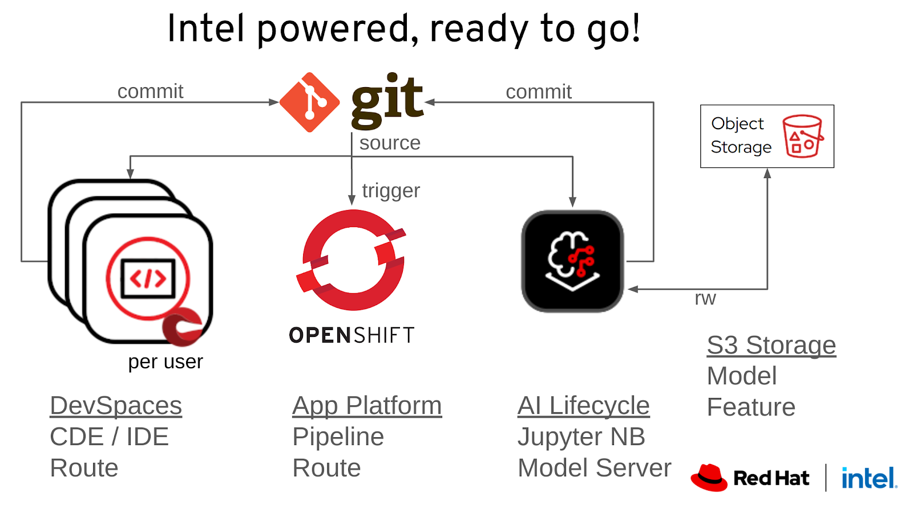

# AI Odyssey 2025 demo-project
<div align="center">

</div>
<br/>

<b>`TODO` - COMPLETE SLIDES</b>
<br/><b>[AI Odyssey Demo Template](https://docs.google.com/presentation/d/1hNml-zEJ53uW1xOFJHf4zDsSAr4EoOBY0MFTheHTV5I/edit?usp=sharing)</b>

## Infrastructure Deployment Instructions
We are using the demo system to setup the ROSA Workshop environment. 
This environment will be modified by replacing the worker nodes with instances that provide the needed accelerators and vRAM.

As part of the setup we deploy OpenShift AI, Dev Spaces, Pipelines, MinIO and setup users into groups with dedicated namespaces. This allows for collaboration in isolated groups such as during a build-a-thon event.

#### The environment is setup to
 * run the Fraud Detection demo incl. S3 connections
 * show the inner/outer loop for application development/deployment
 * serve models
 * integrate models into the application during development/deployment



### Steps to get started
> Start with https://demo.redhat.com
* Search for and deploy [`ROSA Workshop`](https://catalog.demo.redhat.com/catalog/babylon-catalog-prod/order/sandboxes-gpte.rosa-mobb.prod) 
* Using **Hosted Control Plane**
* Set up **cluster admin** in ROSA

> This repo contains `setup.sh` to kick off the set-up process via ssh access to the bastion

> Pre-requisites for the setup are:
- [ ] ssh key with git access ready to copy to bastion

> Questions asked during setup (`grep '_?' setup.sh`):
- [ ] demo cluster information
  - [ ] bastion hostname
  - [ ] bastion ssh password
  - [ ] rosa api url
  - [ ] rosa admin password
- [ ] instance type and min/max # of nodes desired
- [ ] ROSA version to upgrade to (next highest version)

It will start on your local machine by gathering initial information and then copying your public ssh key to the bastion host for future access. There it will run following steps (can be re-started on bastion by providing the step number to `setup.sh` such as `./setup.sh 4`)

> To see all steps `grep 'Step' setup.sh`

1. Local ssh access setup
2. Setup ROSA
3. Configure ROSA machine pool
4. Upgrade ROSA
5. Finish Openshift Setup
6. Install Operators
   * Web Terminal Operator
   * OpenShift Service Mesh
   * OpenShift Serverless
   * Authorino
   * OpenShift AI
   * OpenShift Pipelines
   * OpenShift Dev Spaces
     * CheCluster
7. Create namespace and roles for each team, setup users into groups
   * DevSpaces Application development 
   * OpenShift AI 
     * Minio OBS and two connections
     * Routes
     * Workbench

> You will find the user/group details in the `~/ai-starter/scratch/` folder in the `rosa` home directory on the bastion host

**Preview Output:**
```
source tools/format.sh; eval "$(egrep '\s_{2}\s' setup.sh)"
```

## AI Demo Deployment Instructions

Now for the AI Demo components. The first part above set up the infrastructure for the following submodule to be deployed. Please follow the AI Starter Kit submodule's installation instructions here
[AI Starter Kit Installation Instructions](ai-hackathon-starter)

